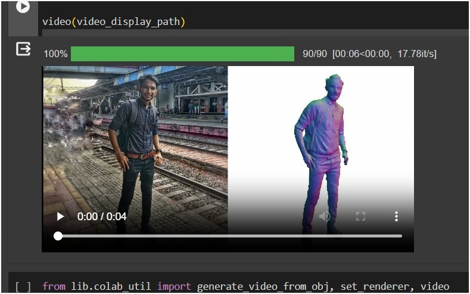
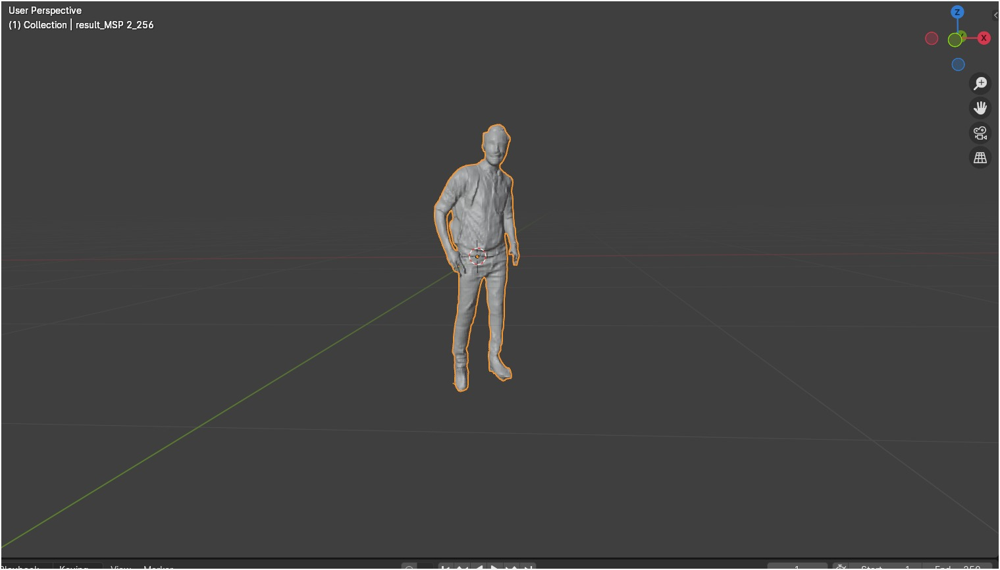
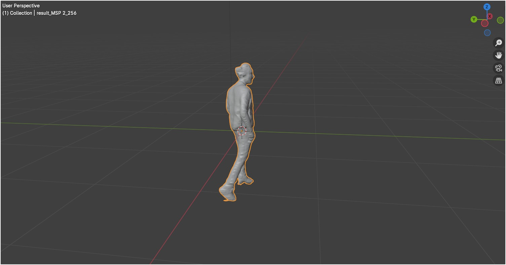
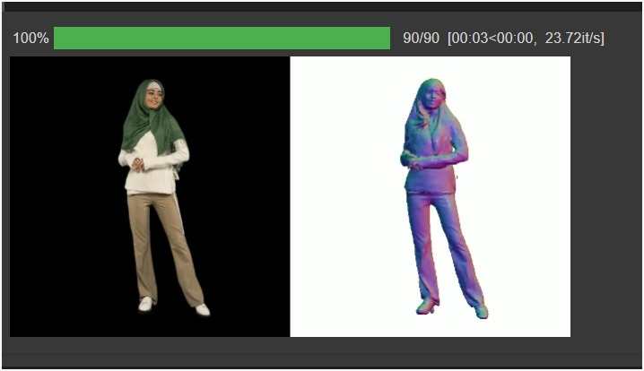

# 🖼️ Image to 3D Model Converter

**Convert 2D images into interactive 3D models using deep learning and computer vision.**
## 🎥 Demo & Screenshots

### Output 1
<p align="center">
  
</p>  

### Output 1 - Image 1 (Imported Output in Blender)  
<p align="center">
  
</p>  
### Output 1 - Image 2 (Imported Output in Blender)  
<p align="center">
  
</p>  


### Output 2
<p align="center">
  
</p>

---

## Demo Videos:

### Output 1 - Video
[📥 Download Demo Video of Output 1 :  Output_Vid.mp4](https://github.com/MohammadSahil007/Image-to-3D-Object/raw/main/Output/Output_Vid.mp4)


### Output 2 - Video(Imported in Blender)
[📥 Download Demo Video of Output 2 :  Output_Vid1.mp4](https://github.com/MohammadSahil007/Image-to-3D-Object/raw/main/Output/Output_Vid1.mp4)

### Model Demo Output - Video

[📥 Download Demo Video of Output 3 :  Output_Vid2.mp4](https://github.com/MohammadSahil007/Image-to-3D-Object/raw/main/Output/Output_Vid2.mp4)

---
## 📌 Overview

This project utilizes Python, OpenCV, and PyTorch3D to convert 2D images into 3D models with enhanced accuracy. It applies background removal techniques to improve the final model output.

## 🚀 Features

✅ Convert 2D images to 3D models using PyTorch3D
✅ Automatic background removal for better accuracy
✅ Optimized image processing for fast conversion
✅ CLI-based tool with future GUI integration plans

## 🛠️ Tech Stack & Tools

- **Programming Language:** Python
- **Computer Vision:** OpenCV
- **Deep Learning & 3D Processing:** PyTorch3D


### 1️⃣ Clone the repository

```bash
git clone [https://github.com/MohammadSahil007/Image-to-3D-Model.git](https://github.com/MohammadSahil007/Image-to-3D-Model.git)
cd Image-to-3D-Model
